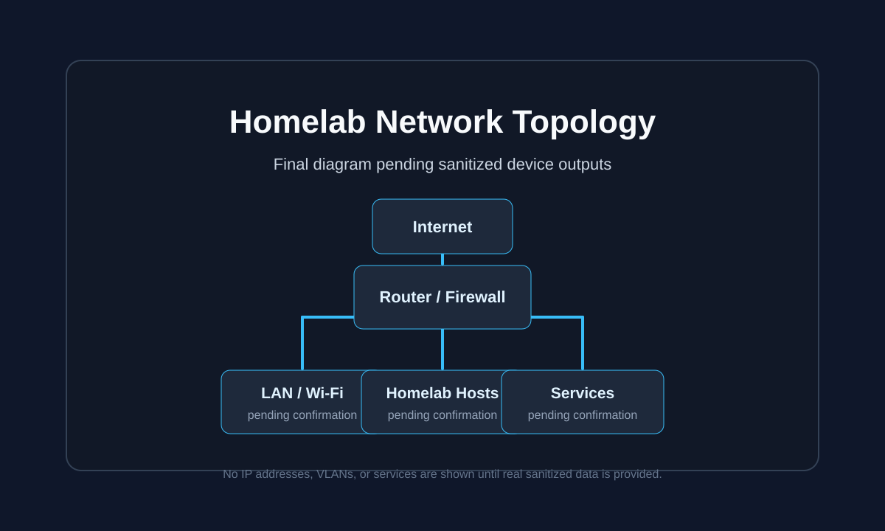

# Homelab Network Topology

Professional public documentation for a home lab / network topology portfolio project.

> Status: initial public documentation scaffold. Final topology assets will be added after the architecture is reviewed for public sharing.

## Goal

This repository documents a real homelab network in a public-safe way:

- Internet edge and router/firewall role
- Physical hosts and core devices
- Proxmox nodes, VMs, and containers
- Raspberry Pi / Linux services
- Docker workloads
- Public-facing services, if intentionally included, shown without exposing sensitive details
- Clean topology diagrams for GitHub README and portfolio use

## Planned Repository Structure

```text
homelab-design/
├── README.md
├── assets/
│   ├── homelab-topology.svg
│   ├── homelab-topology.png
│   └── topology-placeholder.svg
└── docs/
    ├── network-overview.md
    └── public-scope.md
```

## Current Diagram Preview

The final diagram will be added after the public architecture summary is confirmed.



## Public Scope

This repository is intentionally high level. It focuses on architecture, service roles, and infrastructure design decisions without publishing raw device exports or operational details.

See [docs/public-scope.md](docs/public-scope.md) for the public documentation boundaries.

## Documentation Status

- [x] Repository scaffold
- [x] Public documentation boundaries
- [ ] Reviewed public architecture summary
- [ ] Final topology diagram as SVG
- [ ] Final topology diagram as PNG
- [ ] Portfolio-ready README
