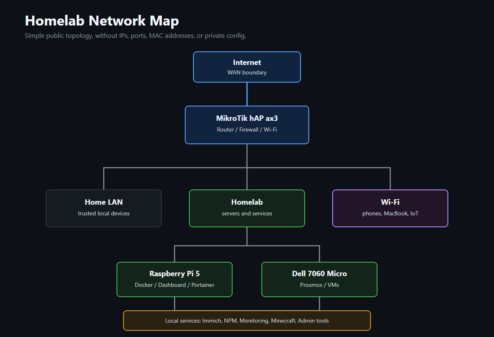

# Homelab Network Map

Simple public network map for my home lab.

## Diagram



SVG version: [assets/homelab-topology.svg](assets/homelab-topology.svg)

## Overview

```text
                         INTERNET
                            |
                            v
                   +-----------------+
                   |  MikroTik hAP   |
                   |      ax3        |
                   | Router / FW     |
                   +--------+--------+
                            |
             +--------------+--------------+
             |              |              |
          HOME LAN       HOMELAB         Wi-Fi
             |              |              |
             |        +-----+-----+        +-- Phones
             |        |           |        +-- MacBook
             |        v           v        +-- IoT
             |   Raspberry Pi   Dell 7060
             |       5          Micro
             |       |          Proxmox
             |       |             |
             |   +---+---+     +---+------+
             |   |   |   |     |   |      |
             | Dashboard |   Ubuntu Debian Kali
             |   Docker       VMs
             |     |
             | +---+------------+
             | |   |            |
             |Immich NPM   Monitoring
             |
             +-------- Local Services
```

This repository intentionally keeps the map high-level and does not include public IPs, passwords, MAC addresses, or private configuration.
